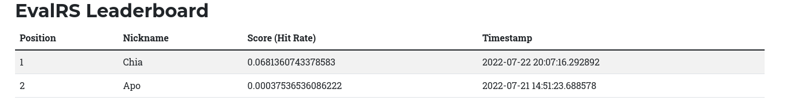

# EvalRS-CIKM-2022
Official Repository for EvalRS @ CIKM 2022: a Rounded Evaluation of Recommender Systems


## Overview

*IMPORTANT*: [EvalRS](https://reclist.io/cikm2022-cup/) is a Data Challenge at [CIKM 2022](https://www.cikm2022.org/). This in-progress repository will host the official scripts and rules for the competition, which is planned for August 2022: add your e-mail [to challenge list](https://docs.google.com/forms/d/e/1FAIpQLSfAypzM1mvd79JfRGRbb9QMfXGMoVYosdjU9C4NFEWNSNUZXQ/viewform) to be notified of important events.

This is the official repository for _EvalRS @ CIKM 2022: a Rounded Evaluation of Recommender Systems_. The aim of the challenge is to evaluate recommender systems across a set of important dimensions (accuracy being _one_ of them) through a principled and re-usable sets of abstractions, as provided by [RecList](https://github.com/jacopotagliabue/reclist) 🚀.

Please refer to the appropriate sections below to know how to register for the challenge and how to run the evaluation loop properly. For questions about the prize, the provided scripts and the rules, please join our Slack (_forthcoming_).

_We are working hard on this: check back often for updates._

### Quick Links

* 🛖 [EvalRS website](https://reclist.io/cikm2022-cup/)
* 📚 [EvalRS paper](https://arxiv.org/abs/2207.05772)
* 📖 [RecList website](https://reclist.io/)

## How To Join

## First Step

* Register [Online](https://reclist.io/cikm2022-cup/leaderboard.html)

### Run the example submission first

A sample submission script is included in this repository as a template. We suggest you run it _as soon as you have received your credentials_ to check that your setup is correct. To do so:

A couple of commands to start; downlad the repo and setup a virtual environment.

```bash
git clone https://github.com/RecList/evalRS-CIKM-2022
python -m venv venv
source venv/bin/activate
pip install -r requirements.txt
```

We use dot files to manage secret keys. Copy the `local.env` file and create an 
`upload.env` (**DO NOT** commit this file). You can fill this file with the keys you got
at step 1.

Now, run

```bash 
python submission.py
```

This first rul will also download the dataset for you (and it won't download it next). The code
runs a random model baseline, computes your score and sent them to the leaderboard. 
Click [here](https://reclist.io/cikm2022-cup/leaderboard.html) to see the leaderboard! It should look like this:



🎉 🎉 🎉 Congrats, everything is working! Now, time to win the challenge!

P.s.: if something in the procedure goes wrong, please contact us through Slack!

### Run your code

A valid submission script can be obtained by copying into your repository `submission.py`, and modify `my_runner.py` and the related model to use your logic instead of the default one. In theory, no change should be necessary to `submission.py`. Your submission is required to build an instance of the class `EvalRSRunner`, providing an implementation for the `train_model.py` method.

In the `evaluation` folder, we included a lenghtier explanation of the evaluation code involved in this challenge: please refer to that file and the provided examples for in-depth explanation, or reach out on Slack if you're unsure on how to use it.

### How easy it is to run the challenge?

Very easy! If you already have a recommendation model, you just need to wrap this in a way that
is consistent with our own API.


```python

class RandomModel:
    def __init__(self, items: pd.DataFrame):
        self.items = items

    def predict(self, user_ids: pd.DataFrame, k=20) -> pd.DataFrame:
        user_ids = user_ids['user_id'].values
        num_users = len(user_ids)
        pred = self.items.sample(n=k*num_users, replace=True)['track_id'].values
        pred = pred.reshape(num_users, k )
        pred = np.concatenate((np.array(user_ids).reshape(-1,1), pred), axis=1)
        
        return pd.DataFrame(pred, columns=['user_id', *[ str(i) for i in range(k)]]).set_index('user_id')

```


## Organizers

This Data Challenge focuses on building in the open, and adding lasting artifacts to the community. _EvalRS @ CIKM 2022_ is a collaboration between practitioners from industry and academia, who joined forces to make it happen:

* Jacopo Tagliabue, Coveo / NYU
* Federico Bianchi, Stanford
* Tobias Schnabel, Microsoft
* Giuseppe Attanasio, Bocconi University
* Ciro Greco, Coveo
* Gabriel de Souza P. Moreira, NVIDIA
* Patrick John Chia, Coveo

## Sponsors

TBC

## How to Cite

TBC