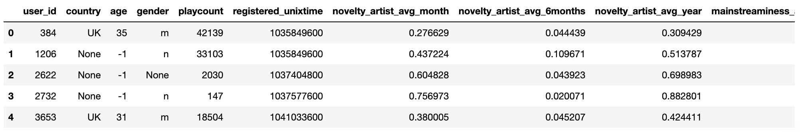
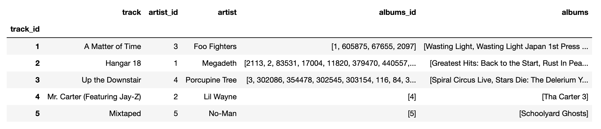
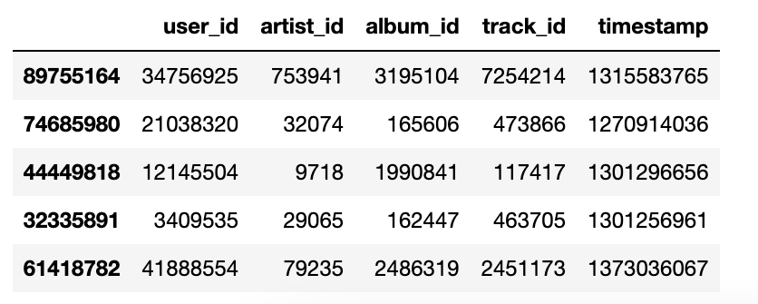
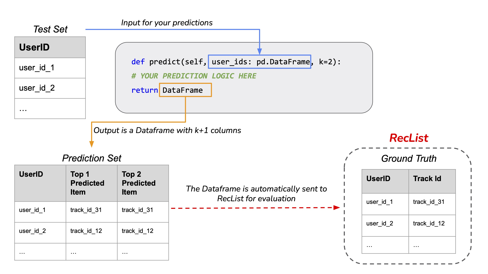

# EvalRS-CIKM-2022
Official Repository for EvalRS @ CIKM 2022: a Rounded Evaluation of Recommender Systems


## Overview

*IMPORTANT*: [EvalRS](https://reclist.io/cikm2022-cup/) is a Data Challenge at [CIKM 2022](https://www.cikm2022.org/). This in-progress repository will host the official scripts and rules for the competition, which is planned for August 2022: add your e-mail [to challenge list](https://docs.google.com/forms/d/e/1FAIpQLSfAypzM1mvd79JfRGRbb9QMfXGMoVYosdjU9C4NFEWNSNUZXQ/viewform) to be notified of important events.

This is the official repository for _EvalRS @ CIKM 2022: a Rounded Evaluation of Recommender Systems_. The aim of the challenge is to evaluate recommender systems across a set of important dimensions (accuracy being _one_ of them) through a principled and re-usable sets of abstractions, as provided by [RecList](https://github.com/jacopotagliabue/reclist) 🚀. During CIKM 2022, we will organize a workshop on rounded evaluation for RecSys, inviting all participants to attend, celebrate the winners, share their learnings wth the community and listen to keynotes from renown practitioners in the field.

Please refer to the appropriate sections below to know how to register for the challenge and how to run the evaluation loop properly. For questions about the prize, the provided scripts and the rules, please join our [Slack](https://reclist.io/cikm2022-cup/).

_We are working hard on this: check back often for updates._

### Important dates

Check the [EvalRS website](https://reclist.io/cikm2022-cup/) for the official timeline, including start date, paper submission and workshop day.

### Quick links

* 🛖 [EvalRS website](https://reclist.io/cikm2022-cup/)
* 📚 [EvalRS paper](https://arxiv.org/abs/2207.05772)
* 📖 [RecList website](https://reclist.io/)


## Dataset and target scenario

This Data Challenge is based on the [LFM-1b Dataset, Corpus of Music Listening Events for Music Recommendation](http://www.cp.jku.at/datasets/LFM-1b/). The use case is a typical user-item recommendation scenario: at _predction time_, we have a set of target users to which we need to recommend a set of songs to listen to. To achieve that, we have historical anonymous data on previous music consumptions from users in the same setting.

Among all possible datasets, we picked LFM as it suits the spirit and the goal of this Challenge: in particular, thanks to [rich meta-data on users and items](http://www.cp.jku.at/people/schedl/Research/Publications/pdf/schedl_ijmir_2017.pdf), the dataset allows us to test recommender systems among many non-obvious dimensions, on top of standard Information Retrieval Metrics (for the philosophy behind behavioral testing, please refer to the original [RecList paper](https://arxiv.org/abs/2111.09963)).

### Data overview

When you run the evaluation loop below (below), the code will automatically download _a chosen subset of the LFM dataset_, ready to be used (the code will download it only the first time you run it). There are three main objects available from the provided evaluation class:

_Users_: a collection of users and available meta-data, including patterns of consumption, demographics etc.. In the Data Challenge scenario, the user Id is the query item for the model, which is asked to recommend songs to the user.



_Tracks_: a collection of tracks and available meta-data. In the Data Challenge scenario, tracks are the target items for the model, i.e. the collection to chose from when the model needs to provide recommendations.




_Historical Interactions_: a collection of interactions between users and tracks, that is, listening events, which should be used by your model to build the recommender system for the Data Challenge.



For in-depth explanations on the code and the template scripts, see the instructions below and check the provided examples and tutorials in `notebooks` and `baselines`.

For information on how the original dataset was built and what meta-data are available, please refer to [this paper](http://www.cp.jku.at/people/schedl/Research/Publications/pdf/schedl_ijmir_2017.pdf).


## How To Join The Race

### First Step: Register

* Register [Online](https://reclist.io/cikm2022-cup/leaderboard.html). You should get some tokens, save them for later! 

### Second Step: Run The Example

A sample submission script is included in this repository as a template. We suggest you run it _as soon as you have received your credentials_ to check that your setup is correct. To do so:

A couple of commands to start; downlad the repo and setup a virtual environment.

```bash
git clone https://github.com/RecList/evalRS-CIKM-2022
python -m venv venv
source venv/bin/activate
pip install -r requirements.txt
```

We use dot files to manage secret keys. Copy the `local.env` file and create an 
`upload.env` (**DO NOT** commit this file). You can fill this file with the keys you got at step 1 (plus some global flags, if you wish to use them in your code - for example an `UPLOAD` flag if you wish to disable upload):

| VARIABLE | TYPE (DEFAULT) | MEANING |
| ------------- | ------------- | ------------- |
| BUCKET_NAME | string  | Bucket name from your registration e-mail |
| EMAIL | string  | E-mail used for registration |
| PARTICIPANT_ID | string  | Id from your registration e-mail  |
| AWS_ACCESS_KEY | string  | AWS access from your registration e-mail  |
| AWS_SECRET_KEY | string  | AWS key from your registration e-mail  |

Now, run

```bash 
python submission.py
```

This first run will also download the dataset for you (and it won't download it again next again unless you specify `force_download=True` when instantiating the ChallengeDataset class). The code
runs a random model baseline, computes the score and sent them to the leaderboard. 
Click [here](https://reclist.io/cikm2022-cup/leaderboard.html) to see the leaderboard! It should look like this:


🎉 🎉 🎉 Congrats, everything is working! Now, time to win the challenge!

P.s.: if something in the procedure goes wrong, please contact us through Slack!

### Third Step: Run your code

A valid submission script can be obtained by copying into your repository `submission.py`, and modify `MyModel.py` to use your logic instead of the default (random) one. Your submission is required to build an instance of a `RecModel`, providing an implementation for the `train` and `predict` methods.

In the `evaluation` folder, we included a lenghtier explanation of the evaluation methodology involved in this challenge; in the `notebooks` folder, we include a step-by-step, heavily commented guide on how to build a submission, including sample data points and an example of using a derived RecList for evaluation. A [Kaggle notebook](https://www.kaggle.com/code/vinidd/cikm-data-challenge) is also available. 

In the `baselines` folder, you will find more complex models than the simple random one. Remember: this competition is about models as much as about _data_ and _testing_ - take our initial work just as an inspiration!

Please refer to the provided examples for in-depth explanations, and don't forget to reach out on Slack if you have any doubt.

## How easy it is to join?

Very easy! If you already have a recommendation model you just need to wrap training and prediction in a model object consistent with our API, i.e. an object having a `train` and `predict` method.

```python

class MyModel(RecModel):
    
    def __init__(self, items: pd.DataFrame, top_k: int=20, **kwargs):
        super(MyModel, self).__init__()
        self.items = items
        self.top_k = top_k
        # kwargs may contain additional arguments in case, for example, you
        # have data augmentation strategies
        print("Received additional arguments: {}".format(kwargs))
        return

    def train(self, train_df: pd.DataFrame):
        """
        Implement here your training logic. Since our example method is a simple random model,
        we actually don't use any training data to build the model, but you should ;-)

        At the end of training, make sure the class contains a trained model you can use in the predict method.
        """
        print(train_df.head(1))
        print("Training completed!")
        return 

    def predict(self, user_ids: pd.DataFrame) -> pd.DataFrame:
        """
        
        This function takes as input all the users that we want to predict the top-k items for, and 
        returns all the predicted songs.

        While in this example is just a random generator, the same logic in your implementation 
        would allow for batch predictions of all the target data points.
        
        """
        k = self.top_k
        num_users = len(user_ids)
        pred = self.items.sample(n=k*num_users, replace=True).index.values
        pred = pred.reshape(num_users, k)
        pred = np.concatenate((user_ids[['user_id']].values, pred), axis=1)
        return pd.DataFrame(pred, columns=['user_id', *[str(i) for i in range(k)]]).set_index('user_id')

```

At prediction time, your function will be fed by our evaluation script with a list of users to provide track recommendations to: you should return a DataFrame echoing the user IDs and then as many columns as the `top-k` parameter specifies:



Your prediction dataframe will also be automatically fed to RecList for evaluation and leaderboard updates. In other words, as long as your `predict` methods comply with this signature, the rest of the workflow is handled magically for you by the evaluation script.

## Data Challenge Structures and Rules

### How the Data Challenge runs

This is a _code competition_, so all teams are required to build and submit in the open: every artifact of this Data Challenge (including tests) is therefore available to the community by design. To partecipate in this Challenge, you are required to submit _your scores AND your code_:

* _when the challenge is running_, compare your progress by regularly submitting to the leaderboard: the final position in the leaderboard is used to determine the winners;
* _before the challenge ends_, submit your code _following the guidelines and rules_ below: without a successful submission, a team won't be considered for the prizes.

Please read carefully the rules and guidelines below and reach out on Slack if you have any doubt.

_IMPORTANT_: a code competition is by necessity (and philosophy) based on a honor code: while we made all the possible arrangements to prevent cheating, we, in the end, must also rely on the good faith of all teams. If you are in doubt regarding any of the rules, please remember the spirit behind EvalRS and always act accordingly.

### Methodology

To avoid cheating when running a competition on a known public dataset, we adopted `Bootstrapped Nested Cross-Validation` as our [methodology](https://arxiv.org/abs/2207.05772). Every time you run the evaluation loop, the ready-made script will prepare 4 random partitions of the dataset, and assign them to the training or testing set for a total of 4 permutations: each time, the training set will be fed to the training function (that you will implement with your logic), and then testing will happen on the predictions (according again to your implementation of the prediction routine). Results from each training+testing step will be aggregated and sent to the leaderboard. At the end of the competition, you will submit your code to the organizers, who should be able, if necessary, to run it and statistically verify that the metrics on the leaderboard are sound.

### Rules and Prizes

_When the challenge is running_

* Everytime you run the evaluation loop, scores on individual folds and the aggregate metrics are sent to the leaderboard. Leaderboard position is determined by our macro-score, as defined in the `evaluation` README with all the tests. For each team, the leaderboard consider only the _best_  macro-score;
* the evaluation is a mix of standard quantitative tests, slice-best metrics and behavioral ones, as abstracted away through [RecList](https://reclist.io/). Tests are defined precisely in the `evaluation` README. For background on behavioral testing, please consult the [original paper](https://arxiv.org/abs/2111.09963);
* given the statistical nature of the evaluation, every run will be slightly different, but it will be possible for the committee to statistically verif at the end that the results are correct, that is, that the score a team achieved on the leaderboard is statistically likely to be generated by the code actually submitted. Submissions that are statistically "too far" from the submitted scores will be disqualified;
* you can submit as many times as you’d like, or even run the evluation loop locally with different env variables for testing or debugging;
* you should not, for any reason, tamper with the evaluation script, or modify it to allow cheating: for example, you should not use in any way the test fold in your code. If you’re unsure how to use it, please reach out on Slack at any time. 

_The final submission_

* Before the end of the Challenge, you are required to submit three artifacts to be eligible for the prize: your code, your paper and one (or more) custom tests;
* your code should be submitted as a Github public repository containing your solution, a Dockerfile with the required dependencies and a MIT license (or similar open source license). After building the container, we should be able to run the evaluation loop in your code in the same way we run the example script in this repository (i.e. follow the instructions in this repo to make sure you utilize the template scripts properly). Please make sure to state in your README any information useful to run the project. _A successful submission MUST run a full evaluation loop on a EC2 XXX in less than YYY minutes._;
* it’s at the sole discretion of the committee to decide whether / how to run the received project for independent verification of your leaderboard score; the committee decision is final. Failing to submit a project with the required information will result in the team being disqualified, irrespective of their leaderboard position;
* irrespectively of their leaderboard position, we asked teams to submit _at least a short design paper_ (details below), or a longer one, if they wish to do so. Note that we have a prize specifically geared towards paper quality. The paper (long or short) should detail the testing approach, with reference to literature, the target dataset or the insights gained by having proper testing when iterating on the leaderboard;
* irrespectively of their leaderboard position, we asked teams to submit _at least one new RecTest_ (the tutorial in the `notebooks` folder shows how to successfully extend the given RecList with your tests). Your test may be as simple as a "unit test" around a specific user, or song, or data slice, or as complex as re-using the provided latent space to evaluate robustness or serendipity: make sure to describe motivations and test logic in your paper (short or long). Note that we have a prize specifically geared towards novel tests. A huge motivation for this challenge is to foster a debate around testing, and sharing insights will make the community richer: all the artifacts of the competition are by design built in the open, and we encourage every practitioner to contribute with their ingenuity.

_The prizes_

Thanks to our generous sponsors, the following prizes will be awarded (at the sole discretion of the committee):

* a winner prize, 3000 USD, for the first position in the leaderboard (subject to a complete submission as described above);
* a runner-up prize, 1000 USD, for the second position in the leaderboard;
* two (2) RecList prizes, 500 USD each, for exceptional contributions in the form of an oustanding paper and / or novel / creative testing methodologies and / or clever data augmentation strategies;
* 5 CIKM virtual attendance tickets to 5 students (on different projects, subject to a complete submission): organizers will consider submission quality and students' backgrounds (precedence to students from under-represented backgrounds). Students can write the paper with other researchers, but they have to appear as the first author in the submitted paper to qualify for the prize.

### Call for Papers

We invite the submissions of two types of paper: short design papers (2 pages plus references) in which authors can briefly describe their model and tests, or longer regular papers (5 pages plus references), in which authors may provide a lengthier description of their approach, engage with the relevant literature and detail the testing strategies they adopted. Teams are required to submit _at least a short paper_ for their submission, but only regular papers will be published through CEUR in the workshop proceedings (all papers will be archived in this repository and all authors will have a chance to present at the hybrid workshop during CIKM).

Submissions should follow the [CEUR Template](https://it.overleaf.com/latex/templates/template-for-submissions-to-ceur-workshop-proceedings-ceur-ws-dot-org/wqyfdgftmcfw). All papers will be peer reviewed (single blind, the papers should _not_ be anynomyzed) by two experts each: reviews are mainly meant at improving and clarifying the work, and ensure the necessarily scholarly standards for CIKM (reference, clarity, rigor). 

_Paper structure_

To help students and younger researchers, we suggest some important questions / common sections for the papers.

Short design papers should answer the following questions:

* Which is the model used in the challenge?
* Which errors did the model make? What did I learned iterating on different tests?
* Did the competition help in debugging RecSys errors?

Regular papers should be structured roughly as follows:

* Introduction: describing the challenge and citing related work;
* Method: describing the solution adopted;
* Experiments
* Data: if any additional pre-processing has been run;
* Hyperparameters: detail on any setup defined for reproducibility;
* Results
* Error analysis
* Discussion and Reflection: an analysis of the results and on the test, and the possible future of testing recommender systems. We are happy to see ideas and speculations.
* Conclusions

Please note that an additional page will be given to integrate reviewers' comments.

## FAQ

* _Can I add information to the dataset provided in the competition?_ Yes, data augmentation strategies are not just allowed, but encorauged, as they will enrich the community with new features after the competition. If you augment the dataset, please state it clearly in your submission and make sure to leverage the additional information in your tests.

_TBC_

## Organizers

This Data Challenge focuses on building in the open, and adding lasting artifacts to the community. _EvalRS @ CIKM 2022_ is a collaboration between practitioners from industry and academia, who joined forces to make it happen:

* Jacopo Tagliabue, Coveo / NYU
* Federico Bianchi, Stanford
* Tobias Schnabel, Microsoft
* Giuseppe Attanasio, Bocconi University
* Ciro Greco, Coveo
* Gabriel de Souza P. Moreira, NVIDIA
* Patrick John Chia, Coveo

## Sponsors

This Data Challenge is open and possible thanks to the generous support of these awesome folks. Make sure to add a star to [our library](https://github.com/jacopotagliabue/reclist) and check them out!

<a href="https://neptune.ai/" target="_blank">
    
</a>

<a href="https://www.comet.com/?utm_source=jacopot&utm_medium=referral&utm_campaign=online_jacopot_2022&utm_content=github_reclist" target="_blank">
    
</a>

<a href="https://gantry.io/" target="_blank">
    
</a>


## How to Cite

If you find our code, datasets, tests useful in your work, please cite the original WebConf contribution as well as the EvalRS paper.

_RecList_

```
@inproceedings{Chia2021BeyondNB,
  title={Beyond NDCG: behavioral testing of recommender systems with RecList},
  author={Patrick John Chia and Jacopo Tagliabue and Federico Bianchi and Chloe He and Brian Ko},
  year={2021}
}
```

_EvalRS_

```
@misc{https://doi.org/10.48550/arxiv.2207.05772,
  doi = {10.48550/ARXIV.2207.05772},
  url = {https://arxiv.org/abs/2207.05772},
  author = {Tagliabue, Jacopo and Bianchi, Federico and Schnabel, Tobias and Attanasio, Giuseppe and Greco, Ciro and Moreira, Gabriel de Souza P. and Chia, Patrick John},
  title = {EvalRS: a Rounded Evaluation of Recommender Systems},
  publisher = {arXiv},
  year = {2022},
  copyright = {Creative Commons Attribution 4.0 International}
}
```
