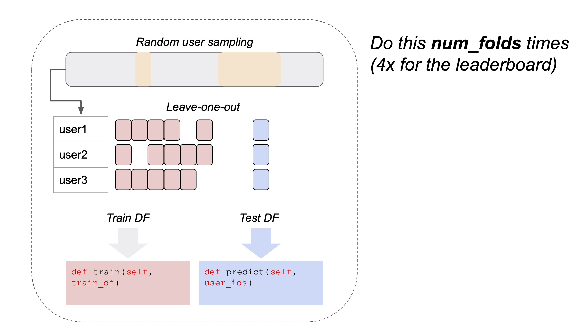
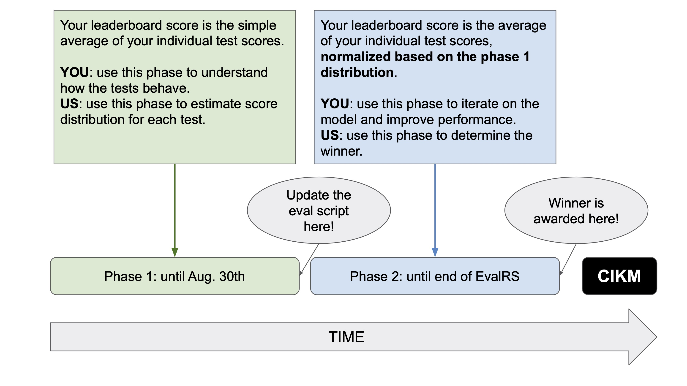

# EvalRS-CIKM-2022 : Evaluation Loop

`EvalRSRunner` (defined in`EvalRSRunner.py`) is a class which encapsulates the evaluation approach for EvalRS (Bootstrapped Nested Cross-Validation). Being this challenge a _code competiton_ on a public dataset, we could not rely on unseen test data to produce a final leaderboard.

Our approach is illustrated in the following diagram: subsets of the original dataset are randomly designated as train and test set; `EvalRSRunner` will automatically feed them to the model object you provide (with your training and prediction logic), and the predictions will be scored with RecList. Sampling is per-user, and testing is based on the "leave-one-out" principle: for each user, we pick a track and leave it for the test set as the target item for the predictions.



This procedure will be repetead _n_ times, and your average scores will be uploaded at the end (the library will take care of it) and determine your position on the leaderboard. The _n_ folds are not ensured to have disjoint sets of users, as they are generated randomly in a stateless fashion: each round in the evaluation loop is independent from the others. Due to the stochastic nature of the loop, scores will vary slightly between runs, but the organizing committee will still be able to statistically evaluate your code submission in the light of your scores. As stated in the rules, since this is a code competition, _reproducibility_ is essential: please take your time to make sure that you understand the submission scripts and that your final project is easily reproducible from scracth.

As demonstrated by the notebook and `submission.py`, you do _not_ have to worry about any of the above implementation details: folds are generated for you and predictions are automatically compared to ground truths by the provided code and RecList.

_Note_: when you instantiate the `ChallengeDataset`, `num_folds` determines how many times the evaluation procedure is run. Default is 4, and that is the value you should use for all your leaderboard submissions.

## How to use the provided abstractions

### Main abstractions

We provide two basic abstractions for the Data Challenge:

* an `EvalRSRunner` class to run the evaluation and submit the scores to the board. _You should not change this class in any way_;
* a `EvalRSRecList` class, implementing a RecList class from the [OS package](https://reclist.io/). _You should not change this class in any way, but you are encouraged to i) understand it, ii) extend it with your own tests for your paper (see the `notebooks` folder for a working example)_. See below for an explanation of the provided tests.

We also provide out-of-the-box utility functions and a template script as an entry point for your final submission (`submission.py`). As long as your training and prediction logic respects the provided model API, you should be able to easily adapt existing models to the Data Challenge.

During the _leaderboard phase_, you can submit your scores to the leaderboard running the code however you prefer. However, at _submission_, your repository needs to comply with the rules in the general `README`. Remember: if we are not able to reproduce your results and statistically verify your scores, you won't be eligible for the prize.

### Build your own evaluation loop

To make a new submission to the leaderboard you are just required to build one new object, a model class containing a `train` and `predict` methods, such as the one contained in the `submission` folder.

First, you should inherit `RecModel` and implement the `train` method: `train` should contain the model training code, _including any necessary hyper-parameter optimization_; if you wish to pass additional parameters to the training function, you can always add them in your init and retrieve them later. You are free to use any modelling technique you want (collaborative filtering, two-tower etc.) as long as your code complies with the Data Challenge rules (no test leaking, hyperparameter and compute time within the budget etc.).

Second, when the training is done, you should wrap your predictions in a method `predict`: `train` should store the trained model inside the class, and `predict` will use that model to provide predictions. The `predict` method accepts as input a dataframe of all the user IDs for which the model is asked to make a prediction on.

For each `user_id`, we expect `k` predictions (where `k=100` for the competition): you can play around with different Ks for debugging purposes _but_ only `k=100` will be accepted for the leaderboard. [The expected prediction output is a dataframe](../images/prediction.jpg) with `user_id` as index and k columns, each representing the ranked recommendations (0th column being the highest rank). In addition, it is expected that the predictions are in the same order as the `user_id` in the input dataframe. An example of the desired dataframe format for `n` `user_ids` and `k` predictions per user is seen in the table below. Note that if your model provides less than `k` predictions for a given `user_id`, the empty columns should be filled with `-1`. 

 |           |  0          | ...        | k-1         | 
| ---------- | ----------  | ---------- | ----------- |
| user_id_1  | track_id_1  | ...        | -1          |
| user_id_2  | track_id_4  | ...        | track_id_5  |
| ...        | ...         | ...        | -1          |
| user_id_n  | track_id_18 | ...        | track_id_9  |


Please note that _the number of examples in the dataframe returned by `predict` and the `user_id` in input should match_ and that the user IDs fed to `predict` by the evaluation loop are _unique_.

_Implementing the class, and returning the trained model in the proper wrapper:_

```python

class MyModel(RecModel):
    
    def __init__(self, items: pd.DataFrame, top_k: int=100, **kwargs):
        super(MyModel, self).__init__()
        self.items = items
        self.top_k = top_k
        # kwargs may contain additional arguments in case, for example, you
        # have data augmentation strategies
        print("Received additional arguments: {}".format(kwargs))
        return

    def train(self, train_df: pd.DataFrame):
        """
        Implement here your training logic. Since our example method is a simple random model,
        we actually don't use any training data to build the model, but you should ;-)

        At the end of training, make sure the class contains a trained model you can use in the predict method.
        """
        print(train_df.head(1))
        print("Training completed!")
        return 

    def predict(self, user_ids: pd.DataFrame) -> pd.DataFrame:
        """
        
        This function takes as input all the users that we want to predict the top-k items for, and 
        returns all the predicted songs.

        While in this example is just a random generator, the same logic in your implementation 
        would allow for batch predictions of all the target data points.
        
        """
        k = self.top_k
        num_users = len(user_ids)
        pred = self.items.sample(n=k*num_users, replace=True).index.values
        pred = pred.reshape(num_users, k)
        pred = np.concatenate((user_ids[['user_id']].values, pred), axis=1)
        return pd.DataFrame(pred, columns=['user_id', *[str(i) for i in range(k)]]).set_index('user_id')

```

As your final code submission, you are also required to contribute a new test: make sure to include an extended RecList in your code.

Please see the `notebooks` folder for a walk-through on the evaluation engine, and check the instructions in the main `README` and the template script in `submission.py` to understand how to make the final code submission.

## Last.FM RecList

We prepared a set of quantitative, sliced-based and behavioral tests for the Last.FM use case, inspired by our [previous work](https://reclist.io/) on the topic and the existing literature on fairness, evaluation and biases.

We detail here the individual tests implemented in the `EvalRSRecList` class, and provide some context on why they are chosen and how they are operationalized: of course, feel free to check the code for implementation details. Once the evaluaton script obtains the test score for each of the individual test below, a _macro-score_ is automatically calculated for the leaderboard: check the logic for the aggregation below.

Please note when you install the `requirements.txt` you will automatically get the appropriate beta version of [RecList](https://reclist.io/), needed to properly run this code.

### Individual tests

In this Data Challenge, you are asked to train a user-item recommendation model: given historical data on users music consumption, your model should recommend the top _k_ songs to a set of test users - generally speaking, given a user U, if the held-out song for U is contained in the top _k_ suggestions, the model has been successful in its predictions.

We now explain in details the tests that we included in `EvalRSRecList` to provide a _rounded_ evaluation of recommender systems. We divide our list in the three subgroups as per [our paper](https://arxiv.org/abs/2207.05772), and explain the motivations behind each.

_Information Retrieval metrics_

* Mean Reciprocal Rank ([MRR](https://en.wikipedia.org/wiki/Mean_reciprocal_rank)): MRR gives a good measure of where the first relevant element is ranked in the output list. Besides being considered a standard rank-aware evaluation metric, we chose MRR as it is particularly simple to compute and to interpret.

* Recall at k (k=100): _Recall at k_ is the proportion of relevant items found in the top-k recommendations. Together with MRR, it is also a standard evaluation metric for Information Retrieval.

_Information Retrieval metrics on a per-group or slice basis_

We are interested in testing models through a number of behavioral tests whose aim is to address a number of known issues for recommender systems, from fairness to robustness. Slices are designed to address a wide spectrum of problems, for instance:  fairness (e.g. your model should have equal outcomes for different groups); robustness (e.g. your model should produce good outcomes for long tail items, such as items with less history or items belonging to less represented categories, etc.); use-cases that are somewhat idiosyncratic to the industry or the use case (e.g. in the case of music, your model should not consistently penalize niche or simply less known artists).

For an overview of fairness in ranking see [Yang and Stoyanovich 2016](https://arxiv.org/pdf/1610.08559.pdf), [Castillo 2019](https://chato.cl/papers/castillo_2018_fairness_in_ranking.pdf), [Zehlike et al. 2021](https://arxiv.org/pdf/2103.14000.pdf); for a discussion about robustness in collaborative recommendations see [O’Mahony 2018](https://citeseerx.ist.psu.edu/viewdoc/download?doi=10.1.1.13.2238&rep=rep1&type=pdf). For a discussion on specific behavioral testing, with a focus on ecommerce see [Tagliabue et al. 2022](https://arxiv.org/abs/2111.09963). 

Tests based on data slices are all based on Hit Rate (HR), defined as ratio between the number of users for which the correct candidate is included in the prediction list and the total number of users in the test set.

For those tests where the partition of the test set consists of a binary class (see Gender Balance below), the final test score is the difference between the HR obtained on the relevant slice and the HR obtained on the original test set (i.e. the general population). For those tests where the partition of the test set consists of a n-ary class (see Artist Popularity below), the final test score is the difference between the HR obtained on each slice and the the HR obtained on the original test set (i.e. ONE-VS-MANY). 

The slice-based tests considered for the final scores are: 

* **Gender balance**. This test is meant to address fairness towards gender, since it is a known problem for recommender systems [Saxena and Jein 2020](https://arxiv.org/abs/2112.02530). Since, the dataset only provides binary gender, in this test you will be asked to minimize the difference between the HR obtained on users who declared Female as gender and the HR obtained on the original test set. We operationalize this test as the smaller the difference, the fairer the model towards potential gender biases. For this you will be asked to minimize this number.

* **Artist popularity**. This test is meant to address a known problem in music recommendation: recommender systems often penalize niche or simply less known artists and users who are less interested in very popular content [Kowald et al. 2020](https://link.springer.com/chapter/10.1007/978-3-030-45442-5_5), [Celma and Cano 2008](https://citeseerx.ist.psu.edu/viewdoc/download?doi=10.1.1.168.5009&rep=rep1&type=pdf). This is particularly important since several important music streaming services (e.g. [Spotify](https://open.spotify.com/), [Tidal](https://tidal.com/)) also act as marketplaces where artists promote their music. In this case, since splitting the testset into two would draw an arbitrary line between popular vs. unpopular artists, failing to capture the actual properties of the distribution, we divided the test set through logarithmic bucketing (i.e. logarithmic bins in base 10). This test is therefore an example of n-ary partition of the test set. Consequently you will be asked to compute the difference between the HR obtained on each slice and the the HR obtained on the original test set (i.e. ONE-VS-MANY); the final number representing your model’s score on the test will be the mean of all the values obtained.

* **User country**. Music consumption is subject to many country dependent factors, such as language differences, local sub-genres and styles, local licensing and distribution laws, cultural influences of local traditional music, etc. Since, as some argued, digitization has led to more diverse cultural markets [Bello and Garcia 2021](https://www.nature.com/articles/s41599-021-00855-1), these factors have deep implications for how people listen to music, how artists, labels and streaming platforms go to market. In this test, we sliced the test set selecting the top-10 countries based on the number of users.

* **Song popularity**. This test is meant to make sure that your model performs adequately both on most-listened tracks and on songs with fewer listening events. In this category you will find both less popular songs and newer songs and therefore the test is designed to address both robustness to long tail items and cold-start scenarios. Also in this case, to avoid setting an arbitrary threshold for popularity, we used logarithmic bucketing in base 10 to divide the test set into bins. 

* **User history**. Users with a long history vs. users with a short history. The test can be viewed as a robustness/cold-start test. Artist history is operationalized in terms of user play counts (i.e. the sum of play counts per artist). Also in this case, to avoid setting an arbitrary threshold for popularity, we used logarithmic bucketing in base 10 to divide the test set into bins. 

_Behavioral and qualitative tests_

* **Be less wrong**. It is important that recommender systems maintain a reasonable standard of relevance even when the predictions are not accurate. For instance, let’s say that the ground truth for a recommendation is the rap song, _‘Humble’_ by Kendric Lamar and that our recommendation system does not get it right. Now our recommender might recommend another rap song from the same year, such as _‘The story of O.J.’_ by Jay-Z, or it might recommend a famous pop song from the top chart of that year, such as _‘Shape of You’_ by Ed Sheeran. There is still a substantial difference between these two as the first one is closer to the ground truth than the second. Since this has a great impact on the overall user experience, it is desirable that models test and measure their performance scenarios like the one just described. In this test, you will be asked to use the latent space of tracks and to report the average distance between the embeddings of the items chosen by your model and those of the ground truth items. Distance is measured in terms of cousin similarly.

* **Latent diversity**: _TBC_

Please note that the RecList used by the evaluation script may (and actually _should_, since your final code submission requires at least one custom test) contain additonal tests on top of the ones that concur to define the leaderboard score. You can, in fact, extend the RecList with as many tests as you want to write your paper, debug your system, uncover some new data insight: remember, EvalRS is about testing as much as scoring! However, only the tests listed above are the ones included in the leaderboard calculation.

### Aggregating the scores into the leadearboard macro-score

As explained in the rules, we adopt a timeline in two phases for the leadeboard scoring:

* in the first phase, scores of individual tests are simply averaged to get the macro-score for the leaderboard (your submission e-mail will still contain detailed information about each test);
* at the start of the second phase (Sept. 1st), you will be required to pull an updated evaluation script from this repository: the new script will contain a novel aggregation function which will be openly shared on Slack. This function will consider the scores for individual tests across all teams in the first phase, and acts as an equalizer between tests - i.e. if a test is easy for everybody, its importance will be downplayed in the macro-score. _Only scores obtained in the second phase are considered for the final prizes_. 

Practically, you won't have to change anything in your model code between the two phases, as everything is handled magically for you by the provided abstractions. As in phase 1, we encourage you to submit often in phase 2 as well.


